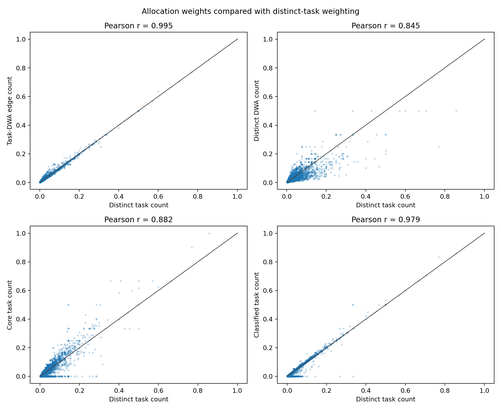
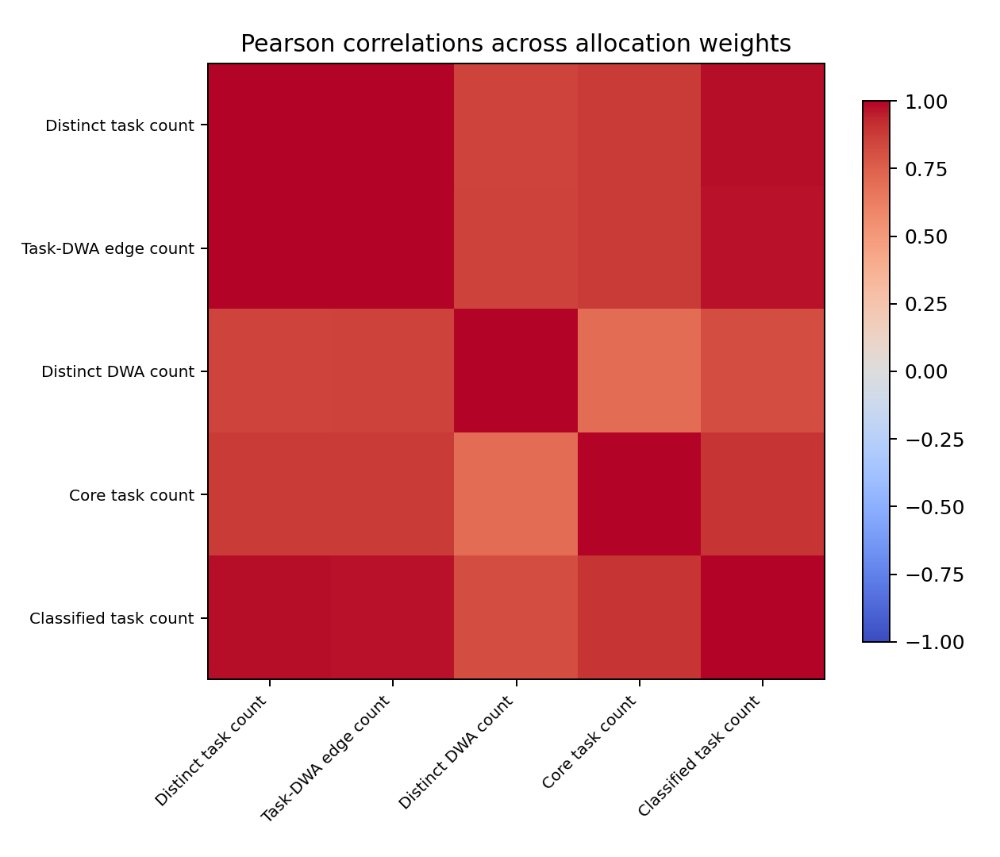

# IWA to O*NET-SOC Mapping - O*NET 30.2

Generated 2026-07-06 from `input/db_30_2_excel`. This report is restricted to `O*NET-SOC Code` occupation identifiers and stays pinned to O*NET 30.2.

## Mapping Path

Use `iwa_to_onet_soc_via_tasks.csv` for IWA to O*NET-SOC analysis:

`IWA Reference` -> `DWA Reference` -> `Tasks to DWAs` -> `O*NET-SOC Code`

## Deliverables

| artifact | rows | description |
| --- | --- | --- |
| iwa_to_onet_soc_via_tasks.csv | 15,285 | IWA to O*NET-SOC mapping, one row per IWA/occupation pair. |
| iwa_occupation_links.csv | 15,285 | Slim IWA-to-occupation edge table with DWA and IWA coverage counts. |
| iwa_to_onet_soc_via_tasks_detail.csv | 23,850 | Audit table with one row per task-to-DWA-to-IWA link. |
| iwa_occupation_counts.csv | 332 | Number of occupations mapped to each IWA. |
| occupation_iwa_counts.csv | 923 | Number of IWAs mapped to each O*NET-SOC occupation. |
| iwa_weight_summary.csv | 5 | Summary statistics for the allocation weight columns. |
| iwa_weight_correlations.csv | 20 | Pearson and Spearman pairwise correlations among allocation weights. |
| iwa_weight_correlations_pearson_matrix.csv | 5 | Pearson correlation matrix for allocation weights. |
| iwa_weight_correlations_spearman_matrix.csv | 5 | Spearman correlation matrix for allocation weights. |
| iwa_weight_scatter.png |  | Scatter plots comparing allocation weights. |
| iwa_weight_correlation_heatmap.png |  | Pearson correlation heatmap for allocation weights. |

## Documentation Basis

Local source: `input/db_30_2_excel/db_30_2_dictionary.pdf`. The local PDF identifies itself as **Data Dictionary - O*NET 30.2 Database**, created February 11, 2026, with 110 pages.

- PDF page 31: `Task Statements` maps O*NET-SOC occupations to task statements and defines the `Task Type` field.
- PDF page 47: `IWA Reference` provides Intermediate Work Activity identifiers.
- PDF page 48: `DWA Reference` links each DWA to exactly one IWA.
- PDF page 49: `Tasks to DWAs` maps task statements to DWAs and consequently to O*NET-SOC occupations.

Internet check: the official O*NET 30.2 online data dictionary confirms the same relationship across [Task Statements](https://www.onetcenter.org/dictionary/30.2/excel/task_statements.html), [IWA Reference](https://www.onetcenter.org/dictionary/30.2/excel/iwa_reference.html), [DWA Reference](https://www.onetcenter.org/dictionary/30.2/excel/dwa_reference.html), and [Tasks to DWAs](https://www.onetcenter.org/dictionary/30.2/excel/tasks_to_dwas.html).

## Source Counts

| source | rows | coverage |
| --- | --- | --- |
| IWA Reference | 332 | All represented in the output mapping |
| DWA Reference | 2,087 | 332 IWAs |
| Tasks to DWAs | 23,850 | 923 O*NET-SOC occupations |
| Task Statements | 18,796 | 923 O*NET-SOC occupations |

## Validation Results

- Every IWA ID is unique: **True**.
- Every DWA ID is unique: **True**.
- Every Task ID is unique in Task Statements: **True**.
- DWAs missing from IWA Reference: **0**.
- IWAs missing from DWA Reference: **0**.
- `Tasks to DWAs` DWA IDs missing from DWA Reference: **0**.
- `Tasks to DWAs` task IDs missing from Task Statements: **0**.
- Task-DWA detail rows with blank `Task Type`, retained as `Unclassified`: **1,066**.

## Mapping Results

- IWA/O*NET-SOC pairs: **15,285**.
- Unique IWAs covered: **332**.
- Unique O*NET-SOC occupations covered: **923**.
- Task-to-DWA-to-IWA detail rows: **23,850**.

## IWA-to-Occupation Link Table

`iwa_occupation_links.csv` is the compact edge table for network or crosswalk use. Each row is one IWA/O*NET-SOC link.

- `link_dwa_count`: number of distinct DWAs connecting that IWA and occupation.
- `iwa_count_for_occupation`: number of distinct IWAs linked to that occupation.
- `occupation_count_for_iwa`: number of distinct occupations linked to that IWA.

| iwa id | iwa title | onet soc code | occupation title | link dwa count | iwa count for occupation | occupation count for iwa |
| --- | --- | --- | --- | --- | --- | --- |
| 4.A.1.a.1.I01 | Study details of artistic productions. | 25-4013.00 | Museum Technicians and Conservators | 1 | 21 | 18 |
| 4.A.1.a.1.I01 | Study details of artistic productions. | 27-1011.00 | Art Directors | 1 | 15 | 18 |
| 4.A.1.a.1.I01 | Study details of artistic productions. | 27-1022.00 | Fashion Designers | 1 | 15 | 18 |
| 4.A.1.a.1.I01 | Study details of artistic productions. | 27-1024.00 | Graphic Designers | 1 | 13 | 18 |
| 4.A.1.a.1.I01 | Study details of artistic productions. | 27-1027.00 | Set and Exhibit Designers | 1 | 20 | 18 |
| 4.A.1.a.1.I01 | Study details of artistic productions. | 27-2011.00 | Actors | 1 | 8 | 18 |
| 4.A.1.a.1.I01 | Study details of artistic productions. | 27-2012.00 | Producers and Directors | 1 | 20 | 18 |
| 4.A.1.a.1.I01 | Study details of artistic productions. | 27-2012.04 | Talent Directors | 1 | 12 | 18 |
| 4.A.1.a.1.I01 | Study details of artistic productions. | 27-2031.00 | Dancers | 1 | 8 | 18 |
| 4.A.1.a.1.I01 | Study details of artistic productions. | 27-2032.00 | Choreographers | 1 | 10 | 18 |

## Occupation And IWA Coverage

The IWA side asks how many occupations each IWA touches. The occupation side asks how many IWAs appear in each occupation.

| metric | n | mean | min | p25 | median | p75 | max |
| --- | --- | --- | --- | --- | --- | --- | --- |
| occupation_count | 332 | 46.039 | 1 | 17.750 | 35 | 58 | 409 |
| iwa_count | 923 | 16.560 | 3 | 13 | 17 | 20 | 33 |

### IWAs With The Most Occupations

| iwa id | iwa title | occupation count | task count | task dwa link count |
| --- | --- | --- | --- | --- |
| 4.A.3.b.6.I08 | Maintain operational records. | 409 | 533 | 547 |
| 4.A.4.b.4.I01 | Supervise personnel activities. | 272 | 326 | 339 |
| 4.A.4.b.4.I12 | Direct organizational operations, activities, or procedures. | 271 | 438 | 466 |
| 4.A.2.b.3.I01 | Maintain current knowledge in area of expertise. | 257 | 371 | 422 |
| 4.A.3.a.1.I03 | Clean tools, equipment, facilities, or work areas. | 232 | 352 | 394 |
| 4.A.4.c.3.I05 | Purchase goods or services. | 195 | 213 | 216 |
| 4.A.4.b.3.I04 | Train others on operational or work procedures. | 193 | 226 | 234 |
| 4.A.4.a.2.I03 | Communicate with others about operational plans or activities. | 185 | 272 | 274 |
| 4.A.1.a.1.I02 | Read documents or materials to inform work processes. | 179 | 200 | 234 |
| 4.A.3.b.4.I02 | Maintain tools or equipment. | 166 | 234 | 249 |

### Occupations With The Most IWAs

| onet soc code | occupation title | iwa count | task count | task dwa link count |
| --- | --- | --- | --- | --- |
| 11-9032.00 | Education Administrators, Kindergarten through Secondary | 33 | 49 | 50 |
| 43-4121.00 | Library Assistants, Clerical | 33 | 42 | 42 |
| 17-2141.00 | Mechanical Engineers | 30 | 38 | 39 |
| 43-6014.00 | Secretaries and Administrative Assistants, Except Legal, Medical, and Executive | 30 | 43 | 43 |
| 49-3011.00 | Aircraft Mechanics and Service Technicians | 30 | 49 | 51 |
| 49-9071.00 | Maintenance and Repair Workers, General | 30 | 38 | 39 |
| 51-4072.00 | Molding, Coremaking, and Casting Machine Setters, Operators, and Tenders, Metal and Plastic | 30 | 43 | 47 |
| 11-1011.00 | Chief Executives | 28 | 40 | 42 |
| 11-9013.00 | Farmers, Ranchers, and Other Agricultural Managers | 28 | 39 | 44 |
| 11-9051.00 | Food Service Managers | 28 | 35 | 36 |

## Core And Supplemental Tasks

O*NET's `Task Type` field distinguishes tasks that are central to an occupation from tasks that are still associated with the occupation but less central. A **Core** task is critical to the occupation: O*NET defines this as task relevance of at least 67% and mean importance of at least 3.0. A **Supplemental** task is less relevant and/or less important: either relevance is at least 67% but mean importance is below 3.0, or relevance is below 67% regardless of importance. Some rows in this release have a blank Task Type; these are retained as `Unclassified` so the mapping does not silently drop valid task-DWA links.

## Allocation Weight Columns

Allocation here means taking an IWA-level quantity, such as a share of messages coded to an IWA, and distributing it across O*NET-SOC occupations. Every `occupation_weight_within_iwa_...` column is normalized within each IWA, so weights sum to 1 across occupations for that IWA when the denominator is nonzero.

| column | basis | when to use |
| --- | --- | --- |
| occupation_weight_within_iwa_task_count | Distinct task count | Best default when one task should count once even if it has multiple DWA links. |
| occupation_weight_within_iwa_task_dwa_links | Task-DWA edge count | Use when multiple DWA links on the same task should count as stronger evidence. |
| occupation_weight_within_iwa_dwa_count | Distinct DWA breadth | Use when breadth of detailed activities matters more than task count. |
| occupation_weight_within_iwa_core_task_count | Core-task-only count | Use for a conservative mapping focused on tasks O*NET marks critical. |
| occupation_weight_within_iwa_classified_task_count | Core plus supplemental count | Use if you want official task categories but want to exclude unclassified rows. |

## Weight Summary

| weight column | basis | n | missing | zero count | mean | median | p75 | max |
| --- | --- | --- | --- | --- | --- | --- | --- | --- |
| occupation_weight_within_iwa_task_count | Distinct task count | 15,285 | 0 | 0 | 0.022 | 0.013 | 0.024 | 1 |
| occupation_weight_within_iwa_task_dwa_links | Task-DWA edge count | 15,285 | 0 | 0 | 0.022 | 0.013 | 0.024 | 1 |
| occupation_weight_within_iwa_dwa_count | Distinct DWA count | 15,285 | 0 | 0 | 0.022 | 0.015 | 0.024 | 1 |
| occupation_weight_within_iwa_core_task_count | Core task count | 15,279 | 6 | 3,566 | 0.022 | 0.012 | 0.025 | 1 |
| occupation_weight_within_iwa_classified_task_count | Classified task count | 15,285 | 0 | 659 | 0.022 | 0.013 | 0.024 | 1 |

## Weight Correlations

The table below compares each alternate weighting scheme with the distinct-task-count default. Full Pearson and Spearman results are in `iwa_weight_correlations.csv`.

| comparison | pearson r |
| --- | --- |
| Distinct task count vs Task-DWA edge count | 0.995 |
| Distinct task count vs Distinct DWA count | 0.845 |
| Distinct task count vs Core task count | 0.882 |
| Distinct task count vs Classified task count | 0.979 |

## Outstanding Questions

- Which allocation column should downstream analysis use as the default? I would start with `occupation_weight_within_iwa_task_count` unless we want task-DWA link multiplicity to carry extra signal.
- Should downstream results include all task evidence, or should they report a core-task-only sensitivity using `occupation_weight_within_iwa_core_task_count`?
- Should the OAI `Other IWA` bucket be excluded, manually reviewed, or apportioned across known IWAs before occupation-level aggregation?
